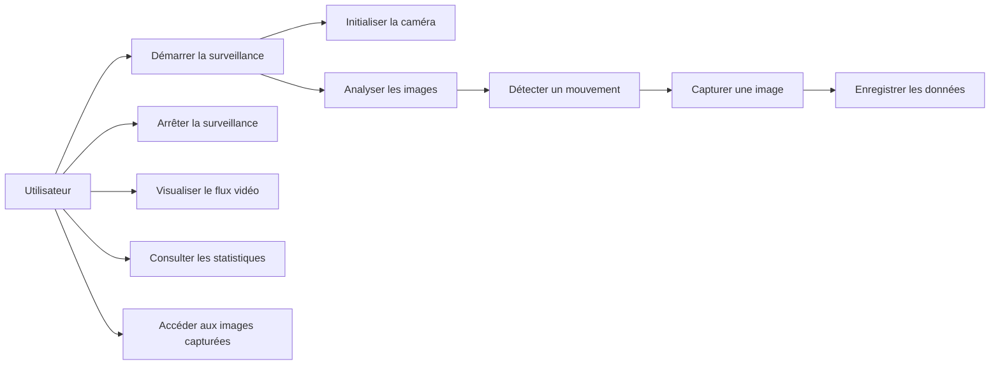
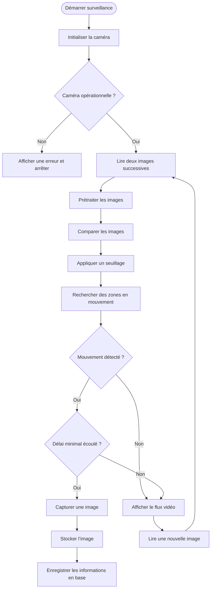
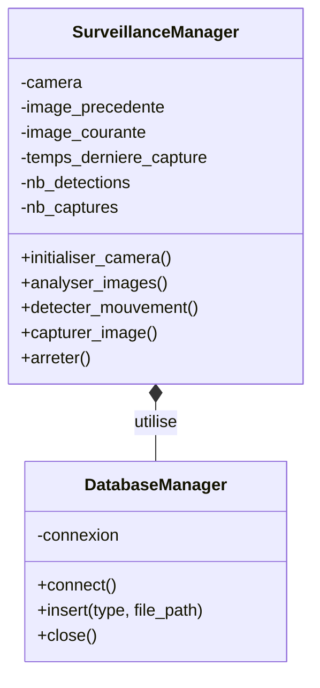
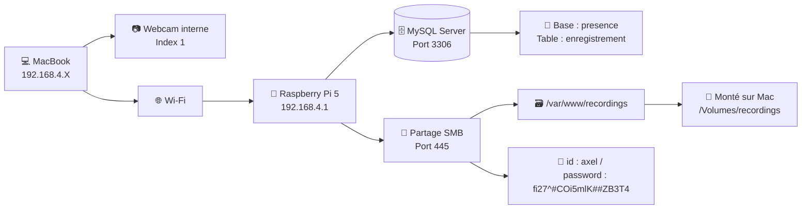
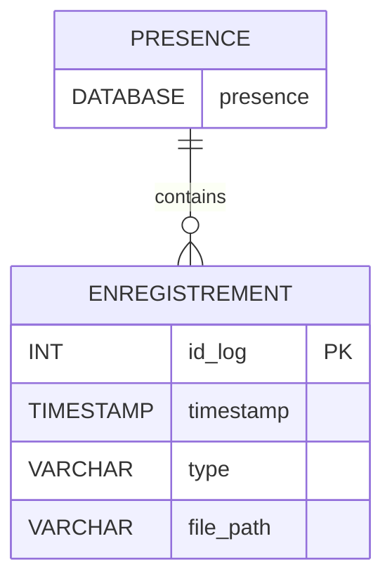

## a) Diagramme de cas d’utilisation (SysML)

---

## b) Diagramme de séquence (SysML)

**Type :** Diagramme de séquence – Détection et capture

---

## c) Diagramme de classes

---

## d) Schéma réseau

---

## e) Schéma de base de données

---

