# **Dossier de mini-projet**


## **Page de garde**

* **Titre du projet :** Vidéo surveillance
* **Noms des étudiants :** L.D. & A.G
* **Classe :** CIEL2
* **Année scolaire :** 2025-2026
* **Enseignant référent :** M. Boudjelaba

---

### Résumé Exécutif du projet 
Ce projet s'inscrit dans le cadre du développement d'un système global de contrôle d'accès et de gestion intelligente pour la salle 215 du lycée. Il se concentre spécifiquement sur la conception d'un module de vidéosurveillance automatisé utilisant Python et OpenCV. Le système analyse le flux vidéo en temps réel pour détecter les mouvements, capture les événements marquants et stocke les images sur un serveur Raspberry Pi centralisé, tout en indexant les chemins d'accès dans une base de données MySQL. L'ensemble est supervisé via une interface web Streamlit, offrant une solution de surveillance efficace, économe en stockage et évolutive.

## Sommaire

- [**Dossier de mini-projet**](#dossier-de-mini-projet)
  - [**Page de garde**](#page-de-garde)
    - [Résumé Exécutif du projet](#résumé-exécutif-du-projet)
  - [Sommaire](#sommaire)
- [**1. Notice d'utilisation**](#1-notice-dutilisation)
  - [**1.1. Objectif du projet**](#11-objectif-du-projet)
  - [**1.2. Prérequis**](#12-prérequis)
  - [**1.3. Procédure d'utilisation**](#13-procédure-dutilisation)
    - [**Étape 1 : Montage du dossier partagé**](#étape-1--montage-du-dossier-partagé)
    - [**Étape 2 : Préparation de l'environnement et installation des librairies**](#étape-2--préparation-de-lenvironnement-et-installation-des-librairies)
    - [**Étape 3 : Test de connexion base de données**](#étape-3--test-de-connexion-base-de-données)
    - [**Étape 4 : Démarrage du système**](#étape-4--démarrage-du-système)
    - [**Étape 5 : Utilisation de l'interface**](#étape-5--utilisation-de-linterface)
    - [**Étape 6 : Arrêt du système**](#étape-6--arrêt-du-système)
  - [**1.4. Conseils et remarques**](#14-conseils-et-remarques)
- [**2. Fiches de recette**](#2-fiches-de-recette)
  - [**Fiche Recette n°1**](#fiche-recette-n1)
    - [Informations générales](#informations-générales)
    - [1. Protocole de test](#1-protocole-de-test)
    - [2. Bilan de test](#2-bilan-de-test)
      - [Évaluation qualitative](#évaluation-qualitative)
      - [Décision finale](#décision-finale)
    - [3. Remarques et anomalies](#3-remarques-et-anomalies)
      - [Commentaires techniques](#commentaires-techniques)
      - [Anomalies identifiées](#anomalies-identifiées)
    - [4. Recommandations d’amélioration](#4-recommandations-damélioration)
  - [**Fiche Recette n°2**](#fiche-recette-n2)
    - [Informations générales](#informations-générales-1)
    - [1. Protocole de test](#1-protocole-de-test-1)
    - [2. Bilan de test](#2-bilan-de-test-1)
      - [Évaluation qualitative](#évaluation-qualitative-1)
      - [Décision finale](#décision-finale-1)
    - [3. Remarques et anomalies](#3-remarques-et-anomalies-1)
      - [Commentaires techniques](#commentaires-techniques-1)
      - [Anomalies identifiées](#anomalies-identifiées-1)
    - [4. Recommandations d’amélioration](#4-recommandations-damélioration-1)
  - [**Fiche Recette n°3**](#fiche-recette-n3)
    - [Informations générales](#informations-générales-2)
    - [1. Protocole de test](#1-protocole-de-test-2)
    - [2. Bilan de test](#2-bilan-de-test-2)
      - [Évaluation qualitative](#évaluation-qualitative-2)
      - [Décision finale](#décision-finale-2)
    - [3. Remarques et anomalies](#3-remarques-et-anomalies-2)
      - [Commentaires techniques](#commentaires-techniques-2)
      - [Anomalies identifiées](#anomalies-identifiées-2)
  - [**Fiche Recette n°4**](#fiche-recette-n4)
    - [Informations générales](#informations-générales-3)
    - [1. Protocole de test](#1-protocole-de-test-3)
    - [2. Bilan de test](#2-bilan-de-test-3)
      - [Évaluation qualitative](#évaluation-qualitative-3)
      - [Décision finale](#décision-finale-3)
    - [3. Remarques et anomalies](#3-remarques-et-anomalies-3)
      - [Anomalies identifiées](#anomalies-identifiées-3)
    - [4. Recommandations d’amélioration](#4-recommandations-damélioration-2)
  - [**Fiche Recette n°5**](#fiche-recette-n5)
    - [Informations générales](#informations-générales-4)
    - [1. Protocole de test](#1-protocole-de-test-4)
    - [2. Bilan de test](#2-bilan-de-test-4)
      - [Évaluation qualitative](#évaluation-qualitative-4)
      - [Décision finale](#décision-finale-4)
    - [3. Remarques et anomalies](#3-remarques-et-anomalies-4)
      - [Commentaires techniques](#commentaires-techniques-3)
      - [Anomalies identifiées](#anomalies-identifiées-4)
- [**3. Rapport du projet**](#3-rapport-du-projet)
  - [**3.1. Introduction**](#31-introduction)
  - [**3.2. Cahier des charges**](#32-cahier-des-charges)
  - [**3.3. Analyse \& Conception**](#33-analyse--conception)
    - [**a) Diagramme de cas d'utilisation (SysML)**](#a-diagramme-de-cas-dutilisation-sysml)
    - [**b) Diagramme de séquence (SysML)**](#b-diagramme-de-séquence-sysml)
    - [**c) Diagramme de Classe**](#c-diagramme-de-classe)
    - [**d) Diagramme de Gantt**](#d-diagramme-de-gantt)
    - [**e) Planning des séances**](#e-planning-des-séances)
    - [**f) Fiche de suivi du projet**](#f-fiche-de-suivi-du-projet)
  - [**3.4. Réalisation**](#34-réalisation)
    - [**a) Description du travail effectué**](#a-description-du-travail-effectué)
    - [**b) Schéma réseau**](#b-schéma-réseau)
    - [**c) Schéma de base de données**](#c-schéma-de-base-de-données)
    - [**d) Compléments base de données**](#d-compléments-base-de-données)
  - [**3.5. Développement \& Tests**](#35-développement--tests)
    - [**a) Code développé (extraits pertinents)**](#a-code-développé-extraits-pertinents)
    - [**b) Tests unitaires**](#b-tests-unitaires)
  - [**3.6. Difficultés rencontrées**](#36-difficultés-rencontrées)
  - [**3.7. Conclusion \& perspectives**](#37-conclusion--perspectives)
- [**4. Annexes**](#4-annexes)
  - [**Annexe A : Structure du projet**](#annexe-a--structure-du-projet)
  - [**Annexe B : Configuration système**](#annexe-b--configuration-système)
  - [**Annexe C : Paramètres de détection**](#annexe-c--paramètres-de-détection)
  - [**Annexe D : Format des fichiers générés**](#annexe-d--format-des-fichiers-générés)
  - [**Annexe E : Lien vers le code source**](#annexe-e--lien-vers-le-code-source)
  - [**Annexe F : Captures d'écran**](#annexe-f--captures-décran)
    - [**La connexion au serveur :**](#la-connexion-au-serveur-)
    - [**Présentation de la page web sans avoir lancé la vidéo surveillance :**](#présentation-de-la-page-web-sans-avoir-lancé-la-vidéo-surveillance-)
    - [**Détection via les carrés vert d'un mouvement et affichage sur la page Web :**](#détection-via-les-carrés-vert-dun-mouvement-et-affichage-sur-la-page-web-)
    - [**Capture d'écran du dossier 'recordings' partagé sur lequel le MacBook envoi les photos :**](#capture-décran-du-dossier-recordings-partagé-sur-lequel-le-macbook-envoi-les-photos-)
    - [**Enregistrement des métadonnées des photos prises par le système de surveillance dans la base de données :**\*](#enregistrement-des-métadonnées-des-photos-prises-par-le-système-de-surveillance-dans-la-base-de-données-)
    - [**Capture de l'écran du Terminal de l'arrêt du programme depuis le bouton de la page Web :**](#capture-de-lécran-du-terminal-de-larrêt-du-programme-depuis-le-bouton-de-la-page-web-)

---

# **1. Notice d'utilisation**

## **1.1. Objectif du projet**

Système de vidéosurveillance temps réel pour PC portable intégré dans une architecture de surveillance distribuée. Le système capture automatiquement des images lors de détections de mouvement et synchronise les données avec un serveur Raspberry Pi 5 centralisé.

**Contexte :** Mini-Projet 1 - Tâche 1 (Vidéosurveillance)

**Fonctionnalités principales :**
- Analyse du flux vidéo par différence d'images
- Détection de mouvement par seuil et contours
- Capture automatique avec horodatage
- Stockage sur dossier partagé SMB
- Enregistrement du chemin de stockage des images dans une base MySQL distante
- Interface de monitoring Streamlit depuis un navigateur

## **1.2. Prérequis**

Pour faire fonctionner le système, l'environnement suivant est nécessaire :

**Matériel :**

  * **Ordinateur de surveillance :** MacBook (ou PC portable) avec Python installé
  * **Dispositif de capture :** Webcam intégrée ou caméra externe (ex : iPhone via Continuity Camera)
  * **Serveur central :** Raspberry Pi 5 (4 Go RAM, 32 Go stockage)
  * **Réseau :** Connexion stable entre l'ordinateur et le Raspberry Pi (Adresse cible : `192.168.4.1`)

**Logiciels et Environnement :**

  * **Langage :** Python 3.13.5 ou supérieur
  * **Éditeur de code :** VSCode (recommandé)
  * **Base de données :** Serveur MySQL actif sur le Raspberry Pi
  * **Système d'exploitation :** macOS (utilisé pour ce projet, backend AVFoundation) ou Windows/Linux

**Librairies Python et installation :**

Les bibliothèques suivantes sont requises pour le fonctionnement du script :

  * `streamlit` : Interface web de monitoring et widgets de contrôle
  * `opencv-python` : Capture vidéo, détection de mouvement et traitement d'image
  * `numpy` : Manipulation optimisée des matrices (utilisé par OpenCV)
  * `mysql-connector-python` : Connecteur officiel pour la communication avec la BDD

**Commande d'installation :**
Exécutez la commande suivante dans votre terminal (ou environnement virtuel) pour installer toutes les dépendances :

```bash
pip install streamlit opencv-python numpy mysql-connector-python
```

**Configurations particulières :**

  * **Accès au dossier partagé (SMB)**

      * **Chemin de montage local :** `/Volumes/recordings`
      * **Utilisateur :** `axel`
      * **Mot de passe :** `fi27^#COi5mlK##ZB3T4`

  * **Connexion Base de données (MySQL)**

      * **Serveur hôte :** `192.168.4.1` (Port 3306)
      * **Nom de la base :** `presence`
      * **Table cible :** `enregistrement`
      * **Utilisateur SQL :** `presence`


## **1.3. Procédure d'utilisation**

### **Étape 1 : Montage du dossier partagé**

**Via Finder :**
1. Ouvrir Finder
2. Menu Aller > Se connecter au serveur (Cmd+K)
3. Saisir : `smb://192.168.4.1/recordings`
4. Utilisateur : `axel`
5. Mot de passe : `fi27^#COi5mlK##ZB3T4`
6. Le dossier apparaît dans `/Volumes/recordings`

**La connexion au serveur :**
> 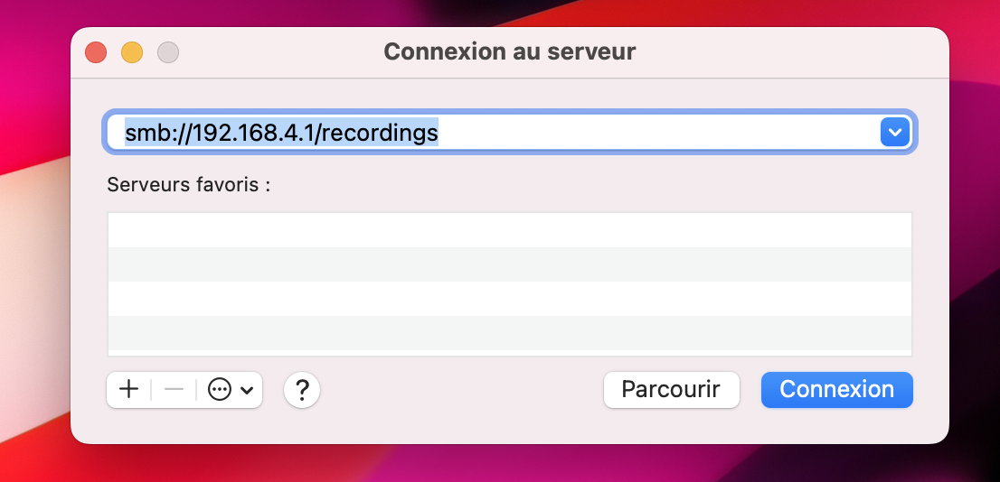

**Via terminal :**
```bash
mkdir -p /Volumes/recordings
mount -t smbfs //axel:fi27^#COi5mlK##ZB3T4@192.168.4.1/recordings /Volumes/recordings
```

**Vérification :**
```bash
ls -la /Volumes/recordings
touch /Volumes/recordings/test.txt && rm /Volumes/recordings/test.txt
```

### **Étape 2 : Préparation de l'environnement et installation des librairies**

```bash
cd /Users/axel/Desktop/surveillance_camera/
python3 -m venv venv
source venv/bin/activate
```
**Ensuite veuillez installer les librairies suivantes, si vous ne l'avez pas déjà fait :**

```bash
pip install streamlit opencv-python numpy mysql-connector-python
```

### **Étape 3 : Test de connexion base de données**

```bash
mysql -h 192.168.4.1 -u presence -p
# Mot de passe : *9RSSFr5bD0WO64qurDY
```

```sql
USE presence;
SELECT * FROM enregistrement ORDER BY id_log DESC LIMIT 5;
```
**Interface d'administration (phpMyAdmin)**

Une interface web de gestion est déployée sur le serveur pour permettre la consultation des logs, la maintenance de la table et la vérification des insertions en temps réel sans ligne de commande.

URL d'accès : `http://192.168.4.1:8080/index.php?route=/sql&pos=0&db=presence&table=enregistrement`

Base de données : `presence`
Mot de passe : `*9RSSFr5bD0WO64qurDY`

**Enregistrement des métadonnées des photos prises par le système de surveillance dans la base de données :***
> 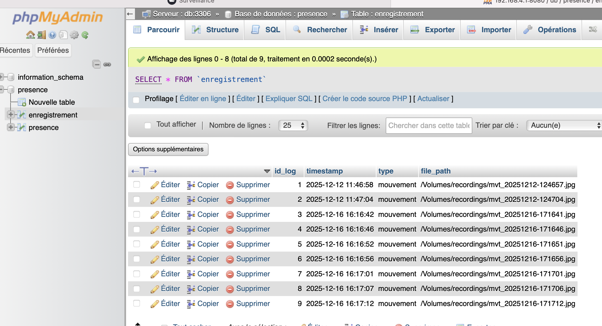

### **Étape 4 : Démarrage du système**

```bash
streamlit run code.py
```

L'interface s'ouvre automatiquement dans le navigateur à l'adresse `http://localhost:8501`

**Présentation de la page web sans avoir lancé la vidéo surveillance :** 
> 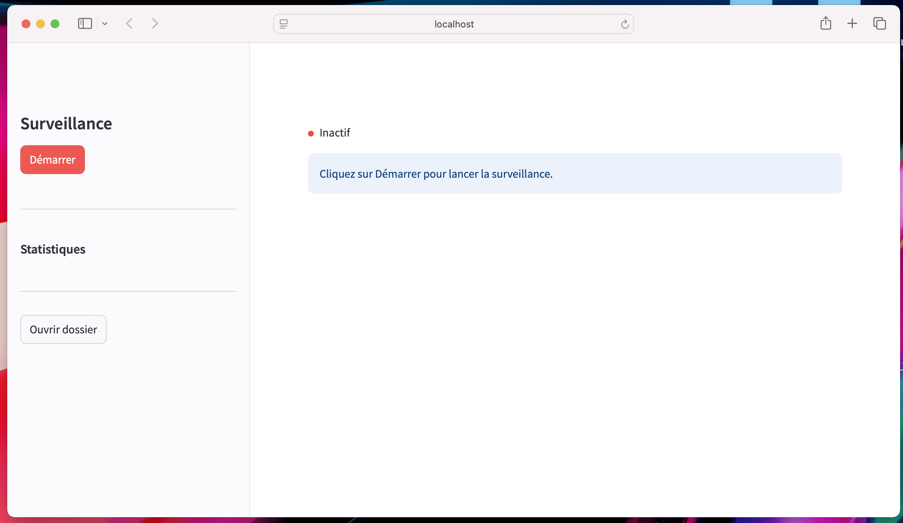


### **Étape 5 : Utilisation de l'interface**

**Barre latérale :**
- Cliquer sur "Démarrer" pour initialiser la caméra et lancer la surveillance
- Les statistiques s'affichent en temps réel (Détections, Captures, Durée)
- Cliquer sur "Arrêter" pour stopper la surveillance
- Cliquer sur "Ouvrir dossier" pour accéder aux captures

**Détection via les carrés vert d'un mouvement et affichage sur la page Web :** 
> 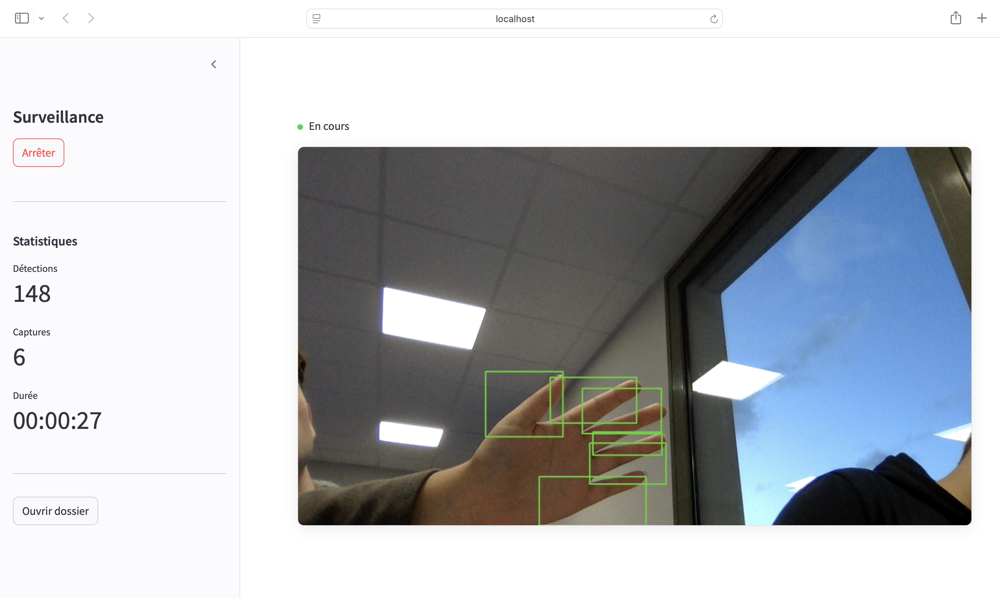

**Zone principale :**
- Flux vidéo en direct avec rectangles verts sur zones en mouvement 

### **Étape 6 : Arrêt du système**

**Via interface :**
- Clic sur "Arrêter" dans la sidebar

**Capture de l'écran du Terminal de l'arrêt du programme depuis le bouton de la page Web :** 
> 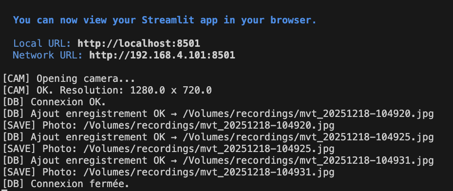


**Puis dans le terminal :**
- `Ctrl+C` 

**Désactivation environnement :**
```bash
deactivate
```

## **1.4. Conseils et remarques**

**Limites connues :**
- Le stockage Raspberry Pi est limité à 32 Go
- Le délai minimal entre captures est de 5 secondes
- La détection nécessite un éclairage stable

**Précautions d'utilisation :**
- Vérifier que le dossier partagé est monté avant le démarrage
- Vérifier la connexion réseau vers `192.168.4.1`
- Ne pas modifier les paramètres de détection sans comprendre leur impact

**Recommandations :**
- Surveiller l'espace disque disponible sur le Raspberry Pi
- Nettoyer régulièrement les anciennes captures
- Maintenir l'environnement virtuel à jour

**Configuration DEBUG :**
- `DEBUG = True` : Active les logs de connexion DB, sauvegardes, résolution caméra
- `DEBUG_MOTION = False` : Logs verbeux de détection (désactivé par défaut)
- Les messages apparaissent dans le terminal exécutant Streamlit

---

# **2. Fiches de recette**

## **Fiche Recette n°1**

**Script [test_camera.py](https://github.com/axel-g-dev/Projet-surveillance/blob/main/prog_de_test/test_camera.py)  
(macOS / OpenCV)**

---

### Informations générales

* **Objet du test :** Script de surveillance par webcam avec détection de mouvement
* **Objectif :**

  * Valider l’initialisation de la caméra
  * Vérifier le mécanisme Start / Pause via la touche Entrée
  * Contrôler la détection de mouvement et l’enregistrement vidéo
* **Version / Build :** v1.0 – Premier jet
* **Environnement :**

  * Système : macOS
  * Bibliothèque : OpenCV (cv2)
  * Driver caméra : `cv2.CAP_AVFOUNDATION`
* **Référence du code :** Script Python audité (voir section Commentaires)

---

### 1. Protocole de test

|  ID | Démarche | Comportement attendu | Résultat | Validation |
| :-: | :------- | :------------------- | :------- | :---------: |
|  1  | **Lancement du script**<br>Exécuter la commande `python test_camera.py` | La fenêtre **"Surveillance"** s’ouvre. Le flux vidéo est visible. Le message **"PAUSE - Appuyez sur ENTREE"** apparaît à l’écran. | | ☑ OK / ☐ KO |
|  2  | **Activation de la surveillance**<br>Appuyer sur la touche **Entrée** | Le message de pause disparaît. La console affiche : `▶ Surveillance ACTIVE`. | | ☑ OK / ☐ KO |
|  3  | **Détection de mouvement**<br>Effectuer un mouvement devant la caméra | Des rectangles verts encadrent les zones en mouvement. Le message **"MOUVEMENT DETECTE"** apparaît en rouge. | | ☑ OK / ☐ KO |
|  4  | **Mise en pause**<br>Appuyer à nouveau sur **Entrée** | Le message **"PAUSE - Appuyez sur ENTREE"** réapparaît. La console affiche : `Surveillance EN PAUSE`. Aucun rectangle ne doit s’afficher malgré les mouvements. | | ☑ OK / ☐ KO |
|  5  | **Arrêt du programme**<br>Appuyer sur **ESC** | La fenêtre vidéo se ferme correctement. Le script se termine sans erreur dans le terminal. | | ☑ OK / ☐ KO |
|  6  | **Vérification de l’enregistrement**<br>Consulter le dossier du script | Le fichier **`surveillance.mp4`** est présent, lisible et correspond à la session enregistrée (vidéo accélérée due au framerate). | | ☑ OK / ☐ KO |

---

### 2. Bilan de test

#### Évaluation qualitative

| Critère | Conforme | Acceptable | Non conforme |
| :------ | :------: | :--------: | :----------: |
| Fonctionnalités | ☑ | ☐ | ☐ |
| Conformité aux attentes | ☑ | ☐ | ☐ |
| Ergonomie utilisateur | ☐ | ☑ | ☐ |
| Stabilité globale | ☐ | ☑ | ☐ |

#### Décision finale

* ☐ **VALIDÉ** – Le script peut être utilisé tel quel
* ☑ **REFUSÉ** – Des corrections sont nécessaires avant validation

---

### 3. Remarques et anomalies

#### Commentaires techniques

* L’image est inversée horizontalement (`cv2.flip(frame, 1)`) afin de corriger l’effet miroir sur macOS.

#### Anomalies identifiées

| Priorité | Description de l’anomalie | ID Issue |
| :------: | :------------------------ | :------: |
| Haute | Erreur possible lors de l’ouverture de la caméra si l’index est incorrect (0 vs 1) | |
| Moyenne | Sensibilité de détection trop élevée ou trop faible selon l’éclairage ; ajuster `threshold_value` et `min_area`. | |

---

### 4. Recommandations d’amélioration

* Centraliser les paramètres caméra (index, FPS, seuils) dans une section de configuration.
* Ajouter un indicateur visuel de l’état (ACTIF / PAUSE) plus explicite à l’écran.
* Enregistrer également la vidéo en mode pause (optionnel, selon le besoin).
* Ajouter des logs horodatés pour faciliter le débogage.

---

**Test effectué par :** Louna, Axel  
**Date :** 09 / 12 / 2025

## **Fiche Recette n°2**

**Script [code_photo.py](https://github.com/axel-g-dev/Projet-surveillance/blob/main/prog_de_test/code_photo.py)  
(macOS / OpenCV)**

---

### Informations générales

* **Objet du test :** Script de surveillance continue avec capture automatique de photos
* **Objectif :**

  * Valider la création automatique du dossier de sauvegarde
  * Vérifier la détection de mouvement sans action utilisateur (démarrage immédiat)
  * Contrôler la sauvegarde des fichiers images (.jpg)
  * **Confirmer l'anomalie d'écrasement des fichiers (doublons de seconde)**
* **Version / Build :** v2.0 – Surveillance Photo
* **Environnement :**

  * Système : macOS
  * Bibliothèque : OpenCV (cv2)
  * Driver caméra : `cv2.CAP_AVFOUNDATION`
* **Référence du code :** Script Python d'enregistrement photo (voir section Commentaires)

---

### 1. Protocole de test

|  ID | Démarche | Comportement attendu | Résultat | Validation |
| :-: | :------- | :------------------- | :------- | :---------: |
|  1  | **Vérification pré-lancement**<br>Vérifier que le dossier défini dans `SAVE_FOLDER` n'existe pas encore. | Le script doit avoir les droits d'écriture. | | ☑ OK / ☐ KO |
|  2  | **Lancement du script**<br>Exécuter la commande `python surveillance_photos.py` | La fenêtre **"Surveillance"** s’ouvre immédiatement. Le flux vidéo est visible. La console affiche : `Camera initialisée avec succès`. Le dossier de sauvegarde est créé automatiquement. | | ☑ OK / ☐ KO |
|  3  | **Détection de mouvement**<br>Effectuer un mouvement devant la caméra. | Des rectangles verts encadrent le mouvement. Le texte **"mouvement"** apparaît. La console affiche en temps réel : `Photo sauvegardée : .../mouvement_YYYYMMDD-HHMMSS.jpg`. | | ☑ OK / ☐ KO |
|  4  | **Test de saturation (Bug suspecté)**<br>Bouger continuellement pendant 3 secondes. | Le script tente de sauvegarder plusieurs images par seconde. **Vérifier dans le dossier :** Est-ce que toutes les images sont là, ou seulement une par seconde ? (Risque d'écrasement). | | ☑ OK / ☐ KO |
|  5  | **Arrêt du programme**<br>Appuyer sur la touche **ESC**. | La fenêtre se ferme. Le script s'arrête proprement avec le message `Arrêt demandé` dans la console. | | ☑ OK / ☐ KO |
|  6  | **Vérification des fichiers**<br>Ouvrir le dossier de sauvegarde. | Les fichiers `.jpg` sont lisibles. **Attention :** Vérifier si le nombre de fichiers correspond au nombre de logs "Photo sauvegardée" dans la console (Anomalie attendue). | | ☐ OK / ☑ KO |

---

### 2. Bilan de test

#### Évaluation qualitative

| Critère | Conforme | Acceptable | Non conforme |
| :------ | :------: | :--------: | :----------: |
| Fonctionnalités | ☐ | ☑ | ☐ |
| Conformité aux attentes | ☐ | ☐ | ☑ |
| Ergonomie utilisateur | ☐ | ☐ | ☑ |
| Stabilité globale | ☑ | ☐ | ☐ |

#### Décision finale

* ☐ **VALIDÉ** – Le script peut être utilisé tel quel
* ☑ **REFUSÉ** – Des corrections sont nécessaires avant validation (Voir section 3)

---

### 3. Remarques et anomalies

#### Commentaires techniques

* **Absence d'interface :** Contrairement au premier script, celui-ci démarre la surveillance immédiatement sans attendre de confirmation (pas de mode "Pause").
* **Chemin en dur :** La variable `SAVE_FOLDER = "/Users/axel/..."` empêchera le script de fonctionner sur un autre ordinateur sans modification manuelle du code, pas de renvoi vers la Base de Données.

#### Anomalies identifiées

| Priorité | Description de l’anomalie | ID Issue |
| :------: | :------------------------ | :------: |
| **Critique** | **Perte de données / Écrasement :** Le nommage des fichiers (`%H%M%S`) n'a qu'une précision à la seconde. Si le script capture 10 images dans la même seconde, seule la dernière est conservée (les 9 autres sont écrasées). | #01 |
| Moyenne | **Absence de contrôle :** L'utilisateur ne peut pas mettre en pause la surveillance pour régler sa caméra sans remplir son disque dur de photos inutiles. | #02 |
| Faible | **Portabilité :** Le chemin du dossier de sauvegarde est absolu et spécifique à un utilisateur. Utiliser un chemin relatif ou `os.path.expanduser("~")`. | #03 |

---

### 4. Recommandations d’amélioration

* **Correction priorité 1 :** Ajouter un délai pour sauvegarder les photos et optimiser le stockage
* **Interface :** Réintégrer la logique de "Start/Pause" avec la touche Entrée pour éviter de capturer l'utilisateur en train de s'installer.

---

**Test effectué par :** Louna et Axel  
**Date :** 09 / 12 / 2025


## **Fiche Recette n°3**

**Script [page_web.py](https://github.com/axel-g-dev/Projet-surveillance/blob/main/prog_de_test/page_web.py)  
(macOS / OpenCV)**

---

### Informations générales

* **Objet du test :** Interface Web de Surveillance (POC Streamlit)
* **Objectif :**
  * Valider l'affichage de l'interface graphique dans le navigateur
  * Tester les boutons interactifs (Démarrer / Arrêter)
  * Comprendre le cycle d'exécution de Streamlit vs boucle infinie Python
* **Version / Build :** v3.0 – Intégration Web (Streamlit)
* **Environnement :**
  * Système : macOS
  * Bibliothèque : `streamlit`, `opencv-python`
  * Driver caméra : `cv2.CAP_AVFOUNDATION`
* **Référence du code / dépôt :** Script `page_web.py` appelant le module `code.py`

---

### 1. Protocole de test

|  ID | Démarche | Comportement attendu | Résultat | Validation |
| :-: | :------- | :------------------- | :------- | :---------: |
|  1  | **Lancement du serveur Web**<br>Exécuter : `streamlit run page_web.py` | Le terminal affiche une URL (ex: `http://localhost:8501`). Une page web s'ouvre automatiquement dans le navigateur. | | ☑ OK / ☐ KO |
|  2  | **Vérification de l'interface**<br>Observer la page web chargée. | Le titre **"Surveillance vidéo"** est visible. Deux boutons **"Démarrer"** et **"Arrêter"** sont présents. | | ☑ OK / ☐ KO |
|  3  | **Action Démarrer**<br>Cliquer sur le bouton "Démarrer". | La variable `run` passe à `True`. La caméra s'initialise (la LED verte du Mac s'allume). | | ☑ OK / ☐ KO |
|  4  | **Vérification du flux vidéo**<br>Observer l'espace sous les boutons. | **Comportement actuel connu :** Une image s'affiche mais reste figée ou ne se rafraîchit pas en temps réel. Le flux n'est pas fluide. | | ☐ OK / ☑ KO |
|  5  | **Action Arrêter**<br>Cliquer sur le bouton "Arrêter". | La variable `run` passe à `False`. La tentative de lecture s'arrête. | | ☑ OK / ☐ KO |
|  6  | **Gestion des erreurs**<br>Vérifier le terminal pendant l'exécution. | Pas de "Traceback" ou d'erreur critique faisant crasher le serveur Streamlit. | | ☑ OK / ☐ KO |

---

### 2. Bilan de test

#### Évaluation qualitative

| Critère | Conforme | Acceptable | Non conforme |
| :------ | :------: | :--------: | :----------: |
| Fonctionnalités | ☐ | ☐ | ☑ |
| Conformité aux attentes | ☐ | ☑ | ☐ |
| Ergonomie utilisateur | ☑ | ☐ | ☐ |
| Stabilité globale | ☐ | ☑ | ☐ |

> *Note : "Conformité aux attentes" est noté Acceptable car l'objectif était pédagogique (comprendre Streamlit) et non fonctionnel (avoir une vidéo fluide).*

#### Décision finale

* ☐ **VALIDÉ**
* ☑ **REFUSÉ** (Le script nécessite une refonte de la boucle pour fonctionner avec Streamlit)

---

### 3. Remarques et anomalies

#### Commentaires techniques

> Streamlit exécute le script de haut en bas à chaque interaction. Une boucle `while True` classique à l'intérieur d'un script Streamlit bloque souvent le rafraîchissement de l'interface (les boutons deviennent inactifs) ou ne rafraîchit l'image qu'une seule fois.

#### Anomalies identifiées

| Priorité | Description de l’anomalie | ID Issue |
| :------: | :------------------------ | :------: |
| **Haute** | **Absence de rafraîchissement vidéo :** Le script affiche une image unique ou fige le navigateur car il manque une commande de rechargement (`st.rerun()`) ou une boucle gérée spécifiquement pour le web. | 01 |

---

**Test effectué par :** Louna et Axel  
**Date :** 09 / 12 / 2025

## **Fiche Recette n°4**

**Script [code_sans_bdd.py](https://github.com/axel-g-dev/Projet-surveillance/blob/main/prog_de_test/code_sans_bdd.py)  
(macOS / OpenCV)**

---

### Informations générales

* **Objet du test :** Application de surveillance par webcam avec détection de mouvement et capture d’images
* **Objectif :**
  * Valider l’initialisation de la caméra via Streamlit
  * Vérifier le contrôle **Démarrer / Arrêter**
  * Contrôler la détection de mouvement en temps réel
  * Vérifier la sauvegarde automatique d’images lors d’un mouvement
  * Vérifier l’affichage des statistiques
* **Version / Build :** **v4.0 – Version Streamlit modulaire**
* **Environnement :**
  * Système : macOS
  * Bibliothèques : OpenCV (cv2), Streamlit, NumPy
  * Driver caméra : `cv2.CAP_AVFOUNDATION`
* **Référence du code :** Script Python audité (SurveillanceManager + interface Streamlit)

---

### 1. Protocole de test

|  ID | Démarche | Comportement attendu | Résultat | Validation |
| :-: | :------- | :------------------- | :------- | :---------: |
|  1  | **Lancement de l’application**<br>Commande : `streamlit run surveillance_streamlit.py` | L’interface Streamlit s’ouvre dans le navigateur. L’état est **Inactif**. Le message *“Cliquez sur Démarrer pour lancer la surveillance”* apparaît. | | ☑ OK / ☐ KO |
|  2  | **Démarrage de la surveillance**<br>Clique sur **Démarrer** | La caméra s’initialise. Le statut passe à **En cours**. Le flux vidéo apparaît. La console affiche les logs `[CAMERA] OK`. | | ☑ OK / ☐ KO |
|  3  | **Détection de mouvement**<br>Effectuer un mouvement devant la caméra | Des rectangles verts entourent les zones en mouvement. Un point vert apparaît en haut à gauche de l’image. Le compteur **Détections** augmente. | | ☑ OK / ☐ KO |
|  4  | **Capture automatique**<br>Maintenir un mouvement | Une image est sauvegardée toutes les X secondes (selon `MIN_TIME_BETWEEN_PHOTOS`). Le compteur **Captures** augmente. | | ☑ OK / ☐ KO |
|  5  | **Arrêt de la surveillance**<br>Clique sur **Arrêter** | Le flux vidéo s’arrête. Le statut passe à **Inactif**. Les statistiques restent affichées. | | ☑ OK / ☐ KO |
|  6  | **Vérification des fichiers**<br>Ouvrir le dossier de sauvegarde | Les fichiers `mouvement_YYYYMMDD-HHMMSS.jpg` sont présents et lisibles. Les images correspondent aux mouvements détectés. | | ☑ OK / ☐ KO |

---

### 2. Bilan de test

#### Évaluation qualitative

| Critère | Conforme | Acceptable | Non conforme |
| :------ | :------: | :--------: | :----------: |
| Fonctionnalités | ☑ | ☐ | ☐ |
| Conformité aux attentes | ☑ | ☐ | ☐ |
| Ergonomie utilisateur | ☑ | ☐ | ☐ |
| Stabilité globale | ☐ | ☑ | ☐ |

#### Décision finale

* ☐ **VALIDÉ** – Le script peut être utilisé tel quel
* ☑ **REFUSÉ** – Il n'y a pas de lien, ni d'envoi à la BDD

---

### 3. Remarques et anomalies

#### Anomalies identifiées

| Priorité | Description de l’anomalie | ID Issue |
| :------: | :------------------------ | :------: |
| Haute | Envoi impossible à la base de données pour l'envoi de données (métadonnées) | 01 |

---

### 4. Recommandations d’amélioration

> Faire un lien avec la base de données 

---

**Test effectué par :** Louna, Axel  
**Date :** 09 / 12 / 2025


## **Fiche Recette n°5**

**Script [code.py](https://github.com/axel-g-dev/Projet-surveillance/blob/main/code.py)  
(macOS / OpenCV / Streamlit / MySQL)**

---

### Informations générales

* **Objet du test :** Interface Web de Surveillance Vidéo avec détection de mouvement
* **Objectif :**
  * Valider l’affichage de l’interface graphique Streamlit dans un navigateur
  * Tester les boutons interactifs (Démarrer / Arrêter)
  * Vérifier la détection de mouvement par OpenCV
  * Valider l’enregistrement des captures et des événements en base de données
  * Vérifier la limitation volontaire des captures pour réduire la charge système
* **Version / Build :** v5.0 – Version finale
* **Environnement :**
  * Système : macOS (tests) / Raspberry Pi (cible)
  * Bibliothèques : `streamlit`, `opencv-python`, `numpy`, `mysql-connector-python`
  * Caméra : USB / intégrée via `cv2.VideoCapture`
* **Référence du code / dépôt :** Script unique `code.py`

---

### 1. Protocole de test

|  ID | Démarche | Comportement attendu | Résultat | Validation |
| :-: | :------- | :------------------- | :------- | :---------: |
|  1  | **Lancement du serveur Web**<br>Exécuter : `streamlit run code.py` | Le terminal affiche une URL locale (ex : `http://localhost:8501`) et la page s’ouvre dans le navigateur. | La page Streamlit se lance correctement. | ☑ OK |
|  2  | **Vérification de l’interface**<br>Observer la page web chargée. | Le titre de l’application est visible. La sidebar affiche les boutons **Démarrer** et **Arrêter** ainsi que les statistiques. | Interface conforme, lisible et stable. | ☑ OK |
|  3  | **Action Démarrer**<br>Cliquer sur le bouton "Démarrer". | La caméra s’initialise, le statut passe à **En cours** et le flux vidéo démarre. | Caméra activée, flux vidéo visible. | ☑ OK |
|  4  | **Vérification du flux vidéo**<br>Observer l’image affichée. | Le flux vidéo se rafraîchit de manière continue dans l’interface. | Flux fluide et mis à jour en temps réel. | ☑ OK |
|  5  | **Détection de mouvement**<br>Provoquer un déplacement devant la caméra. | Les zones de mouvement sont détectées et encadrées. | Détection cohérente, sans faux positifs excessifs. | ☑ OK |
|  6  | **Capture automatique**<br>Maintenir un mouvement devant la caméra. | Une image est enregistrée uniquement si un mouvement est détecté, avec un intervalle minimum de 5 secondes entre deux captures. | Captures espacées, limitation respectée. | ☑ OK |
|  7  | **Enregistrement en base de données**<br>Consulter la base MySQL après une détection. | Une entrée est ajoutée dans la table avec le type d’événement et le chemin du fichier image. | Insertion confirmée sans erreur. | ☑ OK |
|  8  | **Statistiques temps réel**<br>Observer les compteurs. | Les compteurs de détections, de captures et la durée s’actualisent en temps réel. | Statistiques correctes et cohérentes. | ☑ OK |
|  9  | **Action Arrêter**<br>Cliquer sur le bouton "Arrêter". | Le flux vidéo s’arrête et la caméra est libérée. | Arrêt propre sans crash. | ☑ OK |
| 10  | **Gestion des erreurs**<br>Observer le terminal pendant l’exécution. | Aucune erreur critique ou traceback bloquant. | Aucune anomalie détectée. | ☑ OK |

---

### 2. Bilan de test

#### Évaluation qualitative

| Critère                     | Conforme | Acceptable | Non conforme |
| :-------------------------- | :------: | :--------: | :----------: |
| Fonctionnalités             | ☑ | ☐ | ☐ |
| Conformité aux attentes     | ☑ | ☐ | ☐ |
| Ergonomie utilisateur       | ☑ | ☐ | ☐ |
| Stabilité globale           | ☑ | ☐ | ☐ |
| Intégration base de données | ☑ | ☐ | ☐ |
| Performance système         | ☑ | ☐ | ☐ |

#### Décision finale

* ☑ **VALIDÉ**
* ☐ **REFUSÉ**

---

### 3. Remarques et anomalies

#### Commentaires techniques

> La version v5.0 respecte le cycle d’exécution de Streamlit grâce à l’utilisation de `st.session_state` et de zones dynamiques (`st.empty()`).
> La détection de mouvement est réalisée via OpenCV et les captures sont volontairement limitées à une image toutes les 5 secondes afin d’éviter une surcharge CPU, disque et base de données, notamment sur Raspberry Pi.
> Le lien avec la base de données MySQL est opérationnel : chaque capture génère une entrée persistante avec le type d’événement et le chemin du fichier.

#### Anomalies identifiées

| Priorité | Description de l’anomalie | ID Issue |
| :------: | :------------------------ | :------: |
| Basse | Aucune anomalie bloquante constatée lors des tests. | 00 |

---

**Test effectué par :** Louna et Axel  
**Date :** 12 / 12 / 2025


# **3. Rapport du projet**

## **3.1. Introduction**

Dans le cadre du projet de vidéosurveillance (Mini-Projet 1 – Tâche 1), le but est de créer un système de surveillance basé sur la détection de mouvement. Un PC portable équipé d’une webcam s’occupe de détecter les mouvements et de prendre les images, tandis qu’un Raspberry Pi 5 sert de serveur pour stocker et gérer les données.

Le principal défi est de détecter les mouvements de manière fiable, de capturer uniquement les images utiles et de les envoyer vers le serveur, tout en limitant les fausses alertes et l’espace de stockage utilisé.

## **3.2. Cahier des charges**

**Besoin principal :**
Mettre en place un système de vidéosurveillance automatisé pour détecter et enregistrer les événements de mouvement dans une zone surveillée.

**Fonctions attendues :**
- Installation et configuration de la caméra (logiciel)
- Développement Python du programme de surveillance
- Détection automatique de mouvement par analyse d'images
- Capture automatique avec horodatage
- Sauvegarde des photos dans un dossier partagé
- Enregistrement du chemin de stockage des images dans une base MySQL
- Interface de monitoring en temps réel
- Documentation logicielle complète

**Contraintes techniques :**
- Langage : Python 3.13.5
- Système d'exploitation : macOS
- Backend vidéo : AVFoundation (spécifique Mac)
- Serveur : Raspberry Pi 5 (4 Go RAM, 32 Go stockage)
- Base de données : MySQL sur Raspberry Pi `192.168.4.1`
- Stockage : Dossier partagé SMB avec authentification
- Format images : JPEG avec nom horodaté

**Contraintes matérielles :**
- MacBook Pro avec webcam intégrée (Index 1) ou iPhone via Continuity Camera (Index 0)
- Connexion réseau stable entre Mac et Raspberry Pi
- Espace disque suffisant pour le stockage des captures
- Ne pas stocker le flux vidéo 

## **3.3. Analyse & Conception**

### **a) Diagramme de cas d'utilisation (SysML)**

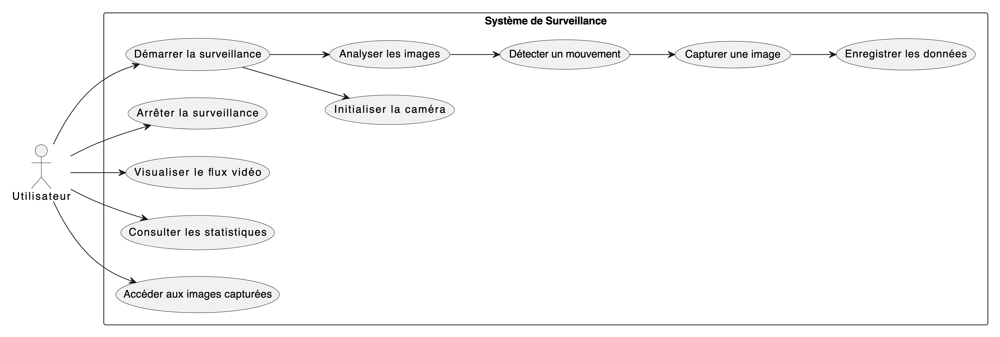

### **b) Diagramme de séquence (SysML)**

**Type :** Diagramme de séquence - Détection et capture

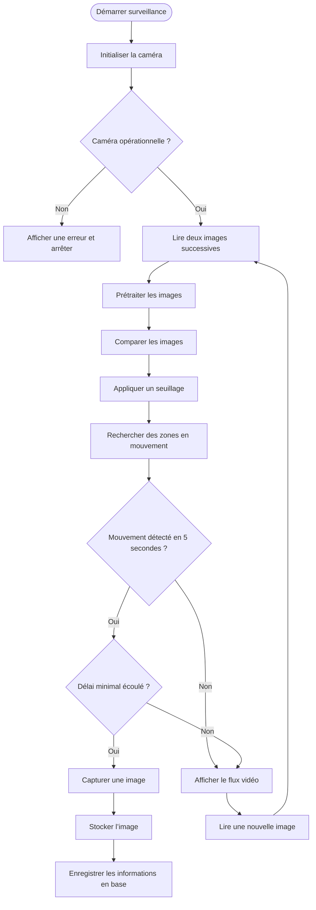
```mermaid
flowchart TD
    A([Démarrer surveillance]) --> B[Initialiser la caméra]
    B --> C{Caméra opérationnelle ?}

    C -- Non --> Z[Afficher une erreur et arrêter]
    C -- Oui --> D[Lire deux images successives]

    D --> E[Prétraiter les images]
    E --> F[Comparer les images]
    F --> G[Appliquer un seuillage]
    G --> H[Rechercher des zones en mouvement]

    H --> I{Mouvement détecté en 5 secondes ?}
    I -- Non --> J[Afficher le flux vidéo]
    I -- Oui --> K{Délai minimal écoulé ?}

    K -- Non --> J
    K -- Oui --> L[Capturer une image]
    L --> M[Stocker l’image]
    M --> N[Enregistrer les informations en base]

    J --> O[Lire une nouvelle image]
    O --> D
```
### **c) Diagramme de Classe**

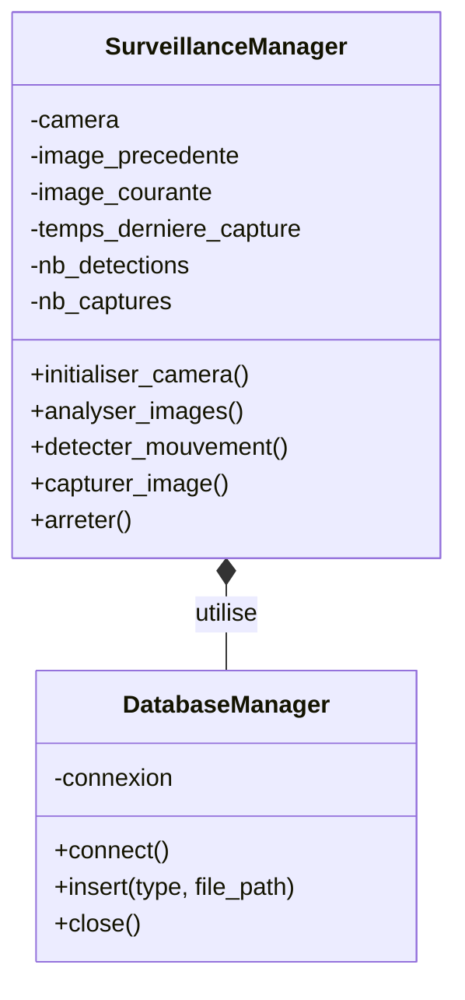
```mermaid
classDiagram
    class DatabaseManager {
        -connexion
        +connect()
        +insert(type, file_path)
        +close()
    }

    class SurveillanceManager {
        -camera
        -image_precedente
        -image_courante
        -temps_derniere_capture
        -nb_detections
        -nb_captures
        +initialiser_camera()
        +analyser_images()
        +detecter_mouvement()
        +capturer_image()
        +arreter()
    }

    SurveillanceManager *-- DatabaseManager : utilise
```

### **d) Diagramme de Gantt**

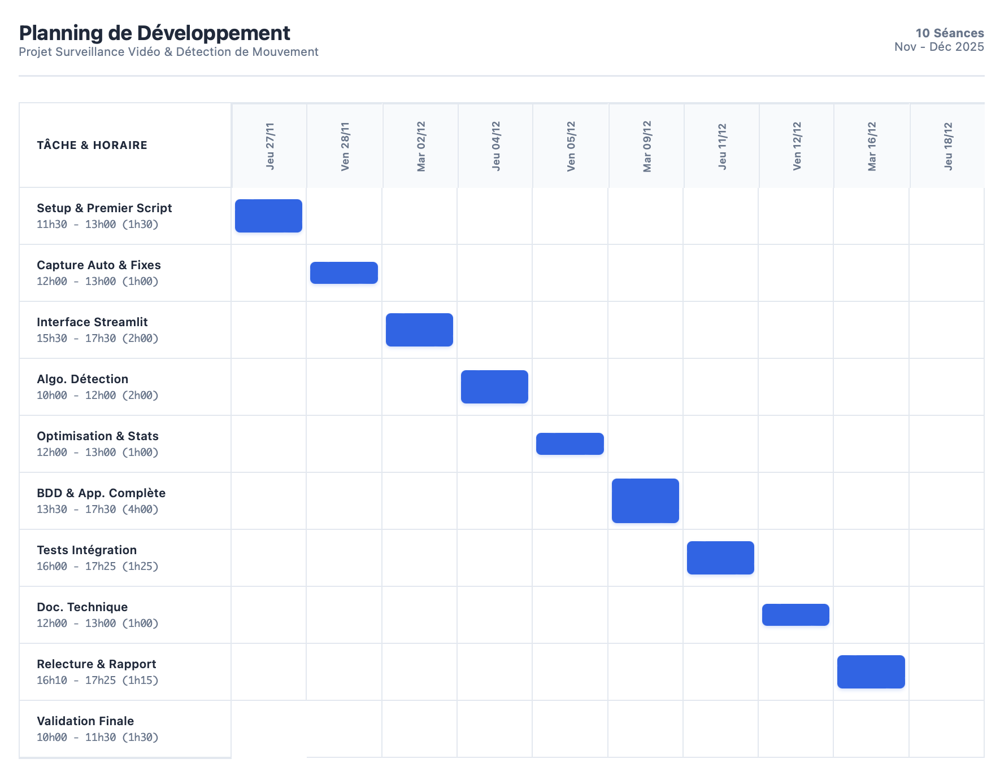

### **e) Planning des séances**

| Séance | Date                      | Horaires      | Travaux réalisés                                                                                                                                                                                                                                                                                                                              |
| :----: | :------------------------ | :------------ | :-------------------------------------------------------------------------------------------------------------------------------------------------------------------------------------------------------------------------------------------------------------------------------------------------------------------------------------------- |
|    1   | Jeudi 27 novembre 2025    | 11h30 – 13h   | Installation de l’environnement de développement Python et des bibliothèques nécessaires (OpenCV). Tests de connexion à la caméra intégrée sur macOS. Développement et exécution d’un premier script de surveillance permettant d’afficher le flux vidéo, de contrôler l’état Start / Pause et de valider une détection de mouvement basique. |
|    2   | Vendredi 28 novembre 2025 | 12h00 – 13h00 | Développement d’un script de surveillance continue avec capture automatique de photos lors d’un mouvement. Mise en place de la création automatique du dossier de sauvegarde et tests de fonctionnement intensifs. Identification d’une anomalie critique liée à l’écrasement des fichiers images.                                            |
|    3   | Mardi 2 décembre 2025     | 15h30 – 17h30 | Structuration progressive du projet et premiers tests d’une interface web avec Streamlit. Analyse du fonctionnement de Streamlit et de son cycle d’exécution. Tests des boutons de contrôle et mise en évidence des limites d’une boucle infinie classique dans une application web.                                                          |
|    4   | Jeudi 4 décembre 2025     | 10h00 – 12h00 | Implémentation complète de l’algorithme de détection de mouvement : prétraitement des images, seuillage, détection de contours et filtrage par surface minimale. Affichage graphique des zones détectées en temps réel sur le flux vidéo.                                                                                                     |
|    5   | Vendredi 5 décembre 2025  | 12h00 – 13h00 | Optimisation des paramètres de détection (sensibilité, surface minimale, flou). Ajout d’une limitation temporelle des captures afin d’éviter la saturation du stockage. Intégration d’un affichage de statistiques en temps réel (détections et captures).                                                                                    |
|    6   | Mardi 9 décembre 2025     | 13h30 – 17h30 | Développement de la version complète de l’application avec interface Streamlit. Connexion à une base de données MySQL, création de la table d’enregistrement et insertion des événements de détection. Réalisation de tests fonctionnels globaux sur l’ensemble de l’application.                                                             |
|    7   | Jeudi 11 décembre 2025    | 16h00 – 17h25 | Réalisation des tests unitaires et des tests d’intégration sur la version finale. Vérification du bon fonctionnement de la détection, des captures, de l’interface et de l’enregistrement en base de données. Validation des fiches recette.                                                                                                  |
|    8   | Vendredi 12 décembre 2025 | 12h00 – 13h00 | Rédaction de la documentation technique du projet. Finalisation des fiches recette, description des choix techniques et rédaction des bilans de test.                                                                                                                                                                                         |
|    9   | Mardi 16 décembre 2025    | 16h10 – 17h25 | Relecture complète de la documentation et du rapport. Vérification de la cohérence entre le planning, les fiches recette et les fonctionnalités développées. Corrections mineures de forme et de contenu.                                                                                                                                     |
|   10   | Jeudi 18 décembre 2025    | 10h00 – 11h30 | Exécution des tests finaux de validation. Vérification de la stabilité de la version finale, contrôle de l’ensemble des fonctionnalités et validation définitive du projet en vue du rendu.                                                                                                                                                   

### **f) Fiche de suivi du projet**

| Tâche                                               | Responsable(s) | Avancement | Difficultés rencontrées / solutions apportées                                                                                                                                                                   |
| --------------------------------------------------- | -------------- | ---------- | --------------------------------------------------------------------------------------------------------------------------------------------------------------------------------------------------------------- |
| Installation et configuration de la caméra          | L.D., A.G.          | 100 %      | Choix de l’index caméra sous macOS (iPhone via Continuity Camera index 0 vs webcam interne index 1). Solution : tests comparatifs et sélection de l’index 1 pour une meilleure stabilité.                       |
| Mise en place de l’environnement de développement   | L.D., A.G.     | 100 %      | Installation de Python 3.13.5, création de l’environnement virtuel et installation des bibliothèques. Aucun blocage majeur rencontré.                                                                           |
| Développement de la détection de mouvement (OpenCV) | L.D., A.G.           | 100 %      | Faux positifs fréquents liés au bruit et à l’éclairage. Solution : ajustement des paramètres `THRESHOLD_VALUE`, `MIN_AREA` et ajout d’un flou gaussien.                                                         |
| Capture et gestion des images                       | L.D., A.G.           | 100 %      | Écrasement des fichiers lors des captures multiples sur une même seconde. Solution : ajout d’une temporisation minimale entre deux captures (`MIN_TIME_BETWEEN_PHOTOS`).                                        |
| Développement de l’interface Streamlit              | L.D., A.G.      | 100 %      | Problème de rafraîchissement du flux vidéo dû au fonctionnement interne de Streamlit. Solution : utilisation de `st.session_state` et de zones dynamiques (`st.empty()`).                                       |
| Mise en place de la base de données MySQL           | L.D., A.G.         | 100 %      | Problèmes initiaux liés au nommage des variables et à la perte de connexion après inactivité. Solution : harmonisation des variables et vérification systématique de l’état de la connexion (`is_connected()`). |
| Intégration OpenCV / Streamlit / Base de données    | L.D., A.G.     | 100 %      | Synchronisation entre capture d’image et insertion en base. Solution : centralisation de la logique dans les classes `SurveillanceManager` et `DatabaseManager`.                                                |
| Tests unitaires et tests d’intégration              | L.D., A.G.     | 100 %      | Validation progressive via fiches recette. Aucune anomalie bloquante sur la version finale.                                                                                                                     |
| Documentation technique et fiches recette           | L.D., A.G.     | 100 %      | Travail conséquent de rédaction et de structuration. Solution : rédaction itérative en parallèle des tests finaux.                                                                                              |
| Tests finaux et validation du projet                | L.D., A.G.     | 100 %      | Vérification de la stabilité globale, du stockage et de l’enregistrement en base. Projet validé sans anomalies critiques.                                                                                       |

## **3.4. Réalisation**

### **a) Description du travail effectué**

Le projet a été réalisé en plusieurs étapes successives :

**1. Configuration de l'environnement :**
- Installation de Python 3.13.5 et création d'un environnement virtuel
- Montage du dossier partagé SMB vers le Raspberry Pi avec authentification
- Installation des librairies : streamlit, opencv-python, numpy, mysql-connector-python

**2. Développement de la base de données :**
- Création de la table `enregistrement` sur MySQL du Raspberry Pi
- Structure : id_log, timestamp, type, file_path

**3. Développement de la classe DatabaseManager :**
- Méthode `connect()` : Connexion TCP vers `192.168.4.1:3306` avec vérification d'état
- Méthode `insert()` : Insertion paramétrée pour éviter l'injection SQL
- Méthode `close()` : Fermeture propre de la connexion

Voici la base de données :

**Enregistrement des métadonnées des photos prises par le système de surveillance dans la base de données :***
> 

**4. Développement de la classe SurveillanceManager :**
- Initialisation de la caméra avec buffer double frame (frame_a, frame_b)
- Algorithme de détection : différence absolue, seuillage à 30, & extraction de contours
- Filtrage par surface minimale (1000 pixels)
- Système de temporisation anti-rafale (5 secondes)
- Annotation visuelle avec rectangles verts

**5. Développement de l'interface Streamlit :**
- Configuration de la mise en page (sidebar, zone principale)
- Boutons de contrôle (Démarrer, Arrêter, Ouvrir dossier)
- Affichage du flux vidéo en temps réel avec redimensionnement automatique
- Statistiques dynamiques (Détections, Captures, Durée)
- Gestion de l'état avec `session_state`

**6. Optimisation des paramètres :**
- THRESHOLD_VALUE = 30 : Équilibre entre sensibilité et faux positifs
- MIN_AREA = 1000 : Filtre les objets < 15 cm
- BLUR_KERNEL = 11x11 : Suppression du bruit webcam
- MIN_TIME_BETWEEN_PHOTOS = 5 : Évite la saturation du stockage, stocke une seulement photo toutes les 5 secondes s'il y a un mouvement

**Choix techniques justifiés :**
- **Streamlit** : Simple à mettre en place, rechargement à chaud, widgets natifs sans HTML/CSS
- **OpenCV** : Open source, support macOS natif, documentation exhaustive avec tutoriels communautaires massifs
- **Numpy** : Opérations vectorisées et plus simples
- **MySQL Connector** : Connecteur officiel permettant l’accès à la base de données, avec prise en charge des requêtes paramétrées et une gestion automatique des délais d’attente (timeouts)


### **b) Schéma réseau**

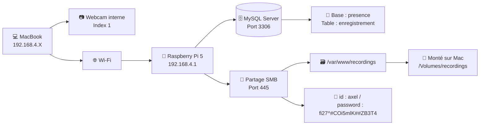
```mermaid
flowchart LR
    Mac[💻 MacBook <br/>192.168.4.X]
    Cam[📷 Webcam interne<br/>Index 1]
    Net[🌐 Wi-Fi]
    Pi[🍓 Raspberry Pi 5<br/>192.168.4.1]

    MySQL[(🗄️ MySQL Server<br/>Port 3306)]
    DB[📂 Base : presence<br/>Table : enregistrement]

    SMB[📁 Partage SMB<br/>Port 445]
    Folder[🗃️ /var/www/recordings]
    Mount[💾 Monté sur Mac<br/>/Volumes/recordings]
    Auth[🔐 id : axel / 
    password : fi27^#COi5mlK##ZB3T4]

    Mac --> Cam
    Mac --> Net --> Pi

    Pi --> MySQL --> DB
    Pi --> SMB --> Folder
    Folder --> Mount
    SMB --> Auth
```
### **c) Schéma de base de données**

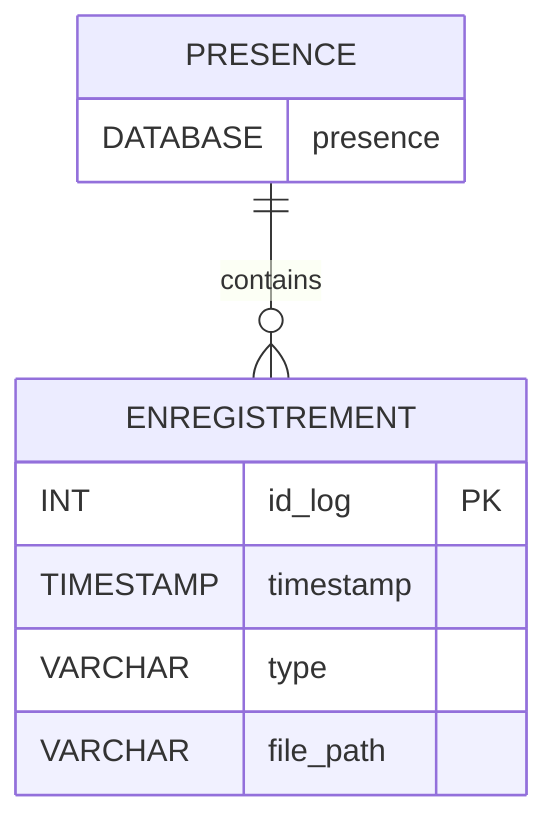
```mermaid
erDiagram
    PRESENCE {
        DATABASE presence
    }

    ENREGISTREMENT {
        INT id_log PK
        TIMESTAMP timestamp
        VARCHAR type
        VARCHAR file_path
    }

    PRESENCE ||--o{ ENREGISTREMENT : contains
```


### **d) Compléments base de données**

**Table : enregistrement**

```sql
DROP TABLE IF EXISTS enregistrement;

CREATE TABLE enregistrement (
    id_log INT(11) NOT NULL AUTO_INCREMENT,
    timestamp TIMESTAMP NOT NULL DEFAULT CURRENT_TIMESTAMP ON UPDATE CURRENT_TIMESTAMP,
    type VARCHAR(50) DEFAULT NULL,
    file_path VARCHAR(255) DEFAULT NULL,
    PRIMARY KEY (id_log)
) ENGINE=InnoDB DEFAULT CHARSET=utf8mb4 COLLATE=utf8mb4_general_ci;
```

**Exemple d'enregistrement :**
```
id_log: 1452
timestamp: 2025-12-02 14:32:04
type: mouvement
file_path: /Volumes/recordings/mvt_20251202-143204.jpg
```

**Particularités :**
- `timestamp` : Mise à jour automatique (ON UPDATE CURRENT_TIMESTAMP)
- `type` : Toujours "mouvement" pour détections webcam
- `file_path` : Chemin absolu tel que vu depuis le Mac
- Moteur InnoDB : Fiabilité transactionnelle
- Charset utf8mb4 : Compatibilité internationale

## **3.5. Développement & Tests**

### **a) Code développé (extraits pertinents)**

**Configuration globale :**
```python
DEBUG = True
DEBUG_MOTION = False
SAVE_FOLDER = "/Volumes/recordings"
CAM_INDEX = 1
THRESHOLD_VALUE = 30
MIN_AREA = 1000
BLUR_KERNEL = (11, 11)
MIN_TIME_BETWEEN_PHOTOS = 5

DB_CONFIG = {
    'host': '192.168.4.1',
    'port': 3306,
    'user': 'presence',
    'password': '*9RSSFr5bD0WO64qurDY',
    'database': 'presence'
}
```

**Classe DatabaseManager :**
```python
class DatabaseManager:
    def __init__(self):
        self.conn = None

    def connect(self):
        if self.conn and self.conn.is_connected():
            return True
        try:
            self.conn = mysql.connector.connect(**DB_CONFIG)
            if DEBUG:
                print("[DB] Connexion OK.")
            return True
        except Exception as e:
            print("[DB] ERREUR:", e)
            return False

    def insert(self, event_type, path):
        if not self.connect():
            return False
        try:
            cursor = self.conn.cursor()
            query = "INSERT INTO enregistrement (type, file_path) VALUES (%s, %s)"
            cursor.execute(query, (event_type, path))
            self.conn.commit()
            cursor.close()
            if DEBUG:
                print(f"[DB] Ajout enregistrement OK → {path}")
            return True
        except Exception as e:
            print("[DB] ERREUR INSERT :", e)
            return False

    def close(self):
        if self.conn and self.conn.is_connected():
            self.conn.close()
            if DEBUG:
                print("[DB] Connexion fermée.")
```

**Classe SurveillanceManager - Méthode de détection :**
```python
def detect_motion(self, fa, fb):
    diff = cv2.absdiff(fa, fb)
    _, th = cv2.threshold(diff, THRESHOLD_VALUE, 255, cv2.THRESH_BINARY)
    dil = cv2.dilate(th, None, iterations=2)
    cnts, _ = cv2.findContours(dil, cv2.RETR_EXTERNAL, cv2.CHAIN_APPROX_SIMPLE)
    return [c for c in cnts if cv2.contourArea(c) > MIN_AREA]
```

**Classe SurveillanceManager - Sauvegarde avec temporisation :**
```python
def save_picture(self, frame):
    now = time.time()
    if now - self.last_capture < MIN_TIME_BETWEEN_PHOTOS:
        return False
    self.last_capture = now
    ts = datetime.now().strftime("%Y%m%d-%H%M%S")
    filename = f"mouvement_{ts}.jpg"
    path = os.path.join(SAVE_FOLDER, filename)
    cv2.imwrite(path, frame)
    self.total_saved += 1
    self.db.insert("mouvement", path)
    if DEBUG:
        print("[SAVE] Photo:", path)
    return True
```

### **b) Tests unitaires**

**Test de la classe DatabaseManager :**
- Vérification de la connexion MySQL
- Test d'insertion d'un enregistrement
- Vérification de la fermeture propre

**Test de la classe SurveillanceManager :**
- Test d'initialisation de la caméra
- Test du prétraitement (conversion gris + flou)
- Test de détection de mouvement avec images synthétiques
- Test du système de temporisation

**Test d'intégration :**
- Test complet du cycle : détection → capture → enregistrement BDD
- Test de la gestion des erreurs réseau
- Test de la reconnexion automatique MySQL

## **3.6. Difficultés rencontrées**

**1. Choix de l'index caméra :**
- **Problème :** MacBook dispose de 2 caméras (iPhone Continuity Camera = Index 0, Webcam interne = Index 1)
- **Solution :** Test des deux indices et sélection de l'index 1 (webcam interne) pour stabilité et disponibilité permanente

**2. Optimisation des paramètres de détection :**
- **Problème :** Trop de faux positifs avec THRESHOLD_VALUE = 20 (détection du bruit numérique)
- **Solution :** Augmentation à 30 et combinaison avec MIN_AREA = 1000 pour filtrage double niveau

**3. Gestion de la reconnexion MySQL :**
- **Problème :** Perte de connexion après inactivité prolongée
- **Solution :** Vérification systématique avec `is_connected()` avant chaque opération et reconnexion automatique

**4. Saturation du stockage :**
- **Problème :** Génération de centaines d'images quasi-identiques lors d'un mouvement prolongé
- **Solution :** Implémentation du système de temporisation MIN_TIME_BETWEEN_PHOTOS = 5 secondes

**5. Performance de l'interface Streamlit :**
- **Problème :** Latence de rafraîchissement avec images haute résolution
- **Solution :** Redimensionnement automatique des frames (max 1200x675) avant affichage

## **3.7. Conclusion & perspectives**

**Bilan du projet :**

Le système de vidéosurveillance implémenté satisfait aux exigences fonctionnelles définies pour la sécurisation de la **salle 215**. Le module assure la chaîne complète de traitement attendue : détection d'intrusion, horodatage des événements et archivage sur serveur distant.

L'architecture distribuée mise en œuvre (Client d'acquisition / Serveur de stockage) valide la robustesse de la solution. La dissociation entre le traitement analytique (Python) et la persistance des données (MySQL) assure la stabilité du service et facilite sa maintenance.

Les choix techniques et architecturaux sont validés par les points suivants :

* **Optimisation des données :** L'enregistrement exclusif des chemins d'accès (URI) en base de données, plutôt que des fichiers binaires, garantit la performance des requêtes SQL et la scalabilité du stockage.
* **Fiabilité de la détection :** L'utilisation d'OpenCV permet un traitement d'image en temps réel, avec un calibrage spécifique (Seuil 30) filtrant efficacement le bruit numérique.
* **Supervision simplifiée :** L'interface Streamlit fournit une console d'administration légère, permettant le pilotage du système sans prérequis techniques complexes.

<br>

**Perspectives d'amélioration :**

**Court terme :**
- Ajout d'un système de notification (email, Telegram) lors de détections
- Implémentation d'une page web de consultation des captures avec galerie
- Ajout de statistiques avancées (graphiques de détections par heure/jour)
- Mécanisme de nettoyage automatique des anciennes captures

**Moyen terme :**
- Intégration de plusieurs caméras dans le système
- Détection par intelligence artificielle (YOLO, MobileNet) pour distinguer humains/animaux/objets
- Enregistrement vidéo en plus des captures photo
- Système de zones de détection personnalisables

**Long terme :**
- Application mobile pour consultation à distance
- Stockage cloud avec chiffrement
- Reconnaissance faciale pour identification des personnes autorisées
- Intégration avec systèmes domotiques (alarme, éclairage)

---

# **4. Annexes**

## **Annexe A : Structure du projet**

```txt
SURVEILLANCE_CAMERA/
├── __pycache__/
│   └── code.cpython-313.pyc
│
├── bdd_sql/
│   └── bdd.sql              # Script SQL de création de la base
│
│
├── prog_de_test/            # Scripts de tests et prototypes
│   ├── code_photo.py        # Capture automatique de photos
│   ├── code_sans_bdd.py     # Version Streamlit sans base de données
│   ├── page_web.py          # Prototype interface web Streamlit
│   └── test_camera.py       # Test basique de la caméra
│
├── projet/                  # Documentation du mini-projet
│   ├── fiches_recette/      # Fiches de tests et validations
│   │   ├── fiche_recette_1.md
│   │   ├── fiche_recette_2.md
│   │   ├── fiche_recette_3.md
│   │   ├── fiche_recette_4.md
│   │   ├── fiche_recette_5.md
│   │   └── fiche_recette_modele.md
│   │
│   ├── images/              # Schémas et captures d’écran
│   │   ├── bdd.png
│   │   ├── detection_page_web.png
│   │   ├── dossier_recordings_partage.png
│   │   ├── gantt.png
│   │   ├── page_web.png
│   │   ├── smb.png
│   │   └── SysML.png
│   │
│   ├── diagrammes.md        # Diagrammes (SysML, séquence, classe)
│   └── documentation.md    # Documentation complète du projet
│
├── .gitignore
├── code.py                  # Script principal (version finale)
└── README.md                # Présentation du projet
```

## **Annexe B : Configuration système**

**MacBook Pro :**
- Système : macOS
- Python : 3.13.5
- Caméra : Index 1 (webcam interne)

**Raspberry Pi 5 :**
- RAM : 4 Go
- Stockage : 32 Go
- IP : `192.168.4.1`
- Partage : SMB sur `/var/www/recordings`
- MySQL : Port `3306`, base `presence` et table `enregistrement`

## **Annexe C : Paramètres de détection**

| Paramètre | Valeur | Justification |
|-----------|--------|---------------|
| THRESHOLD_VALUE | 30 | Équilibre sensibilité/faux positifs pour intérieur |
| MIN_AREA | 1000 | Filtre objets < 15 cm, cible visage/torse humain |
| BLUR_KERNEL | 11x11 | Suppression bruit webcam sans dégrader contours |
| MIN_TIME_BETWEEN_PHOTOS | 5 sec | Évite saturation stockage, capture 12 phases/minute |
| CAM_INDEX | 1 | Webcam interne MacBook (0 = iPhone) |

## **Annexe D : Format des fichiers générés**

**Nom de fichier :**
```
mvt_YYYYMMDD-HHMMSS.jpg
```

**Exemples :**
```
mvt_20251213-093042.jpg
mvt_20251213-152318.jpg
```

**Propriétés JPEG :**
- Qualité : 95% (défaut OpenCV)
- Résolution : 1280x720 (webcam MacBook)
- Taille : 150-300 Ko selon complexité scène

## **Annexe E : Lien vers le code source**

* **Le code source est disponible sur GitHub : [lien du projet](https://github.com/axel-g-dev/Projet-surveillance)**

## **Annexe F : Captures d'écran**

### **La connexion au serveur :**
> 

### **Présentation de la page web sans avoir lancé la vidéo surveillance :** 
> 

### **Détection via les carrés vert d'un mouvement et affichage sur la page Web :** 
> 

### **Capture d'écran du dossier 'recordings' partagé sur lequel le MacBook envoi les photos :**
> 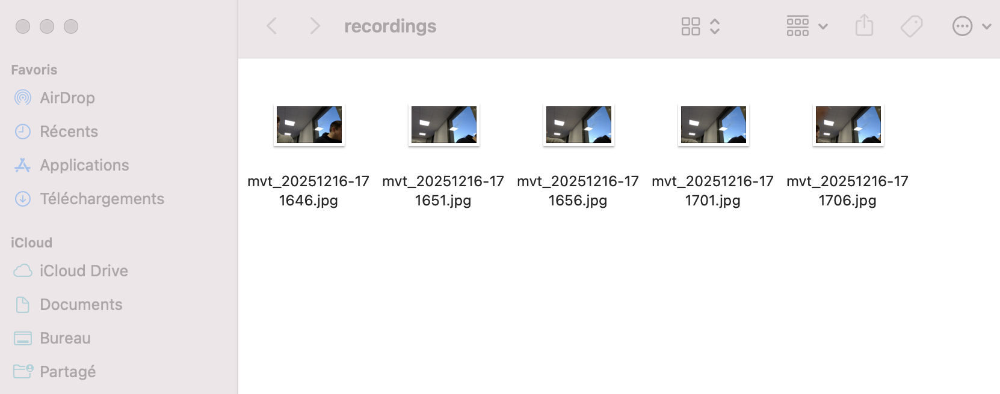

### **Enregistrement des métadonnées des photos prises par le système de surveillance dans la base de données :***
> 

### **Capture de l'écran du Terminal de l'arrêt du programme depuis le bouton de la page Web :** 
> 
